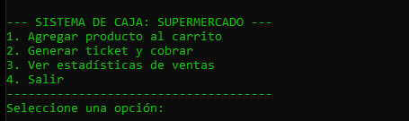
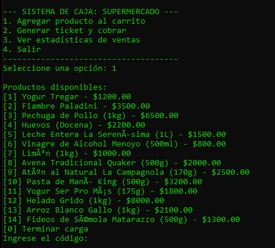
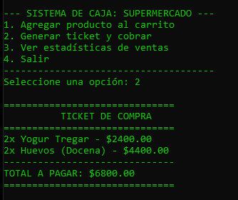
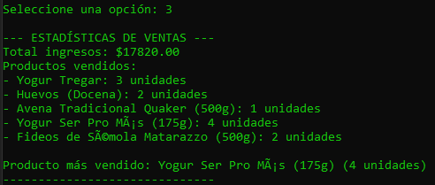

# Sistema de Gestión de Supermercado (Escenario 12)

## Información del Equipo
- Integrantes:
- Alan Quenardelle
- Franco Rolando Nahuel TEJERINA
- Villalba Luciano Alberto

## Comisión: k1.4 - Grupo D38
## Link del video: https://youtu.be/cFQKmu9_RKU?si=AB7dsS8bkbVluUhb

## Uso de Inteligencia Artificial
 - IA Utilizada: Gemini
 - Usos:
  - Se utilizo para generar ideas sobre posibles implementaciones, e ideas de como estructurar bien el archivo README.
  - Solucionar errores de sintaxis.
  - Implementación de lectura y generación de archivos txt.
  - Se solicitaron bloques de código modulares que luego el equipo analizó, adaptó y testeó antes de integrarlos al archivo principal.
  - Se solicito la posibilidad de simplificar bloques de código.
   
## Descripción General
Este proyecto es un Trabajo Final Integrador desarrollado en Python que simula el funcionamiento básico de una caja de supermercado. Permite la carga de productos, cálculo de totales con aplicación automática de promociones (10% de descuento en compras superiores a $15000), generación de tickets por consola y un registro estadístico de ventas (recaudación total y productos más vendidos).

## Instrucciones de Ejecución
1. Asegúrate de tener Python 3.x instalado en tu sistema.
2. Clona este repositorio o descarga el archivo `main.py`.
3. Abre una terminal o consola de comandos en el directorio del archivo.
4. Ejecuta el siguiente comando:
   ```bash
   python main.py

## Vista previa del Proyecto
- Menu principal
  
  
  
- Opción de cargar productos al carrito
  
  

- Impresión de ticket
  
  
  
- Estadisticas de venta
  
  
